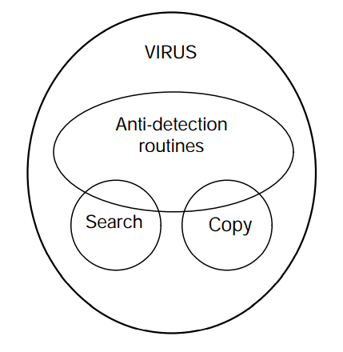
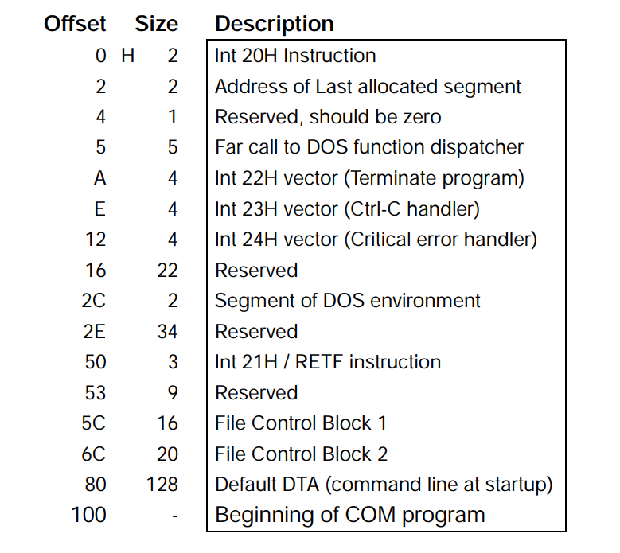
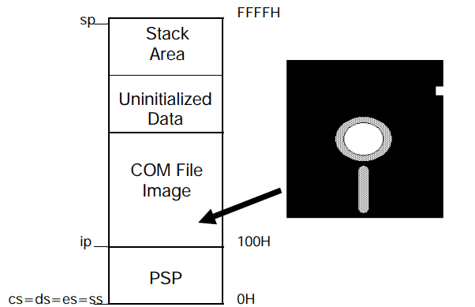
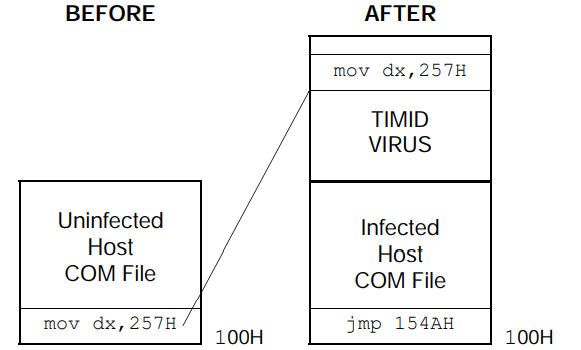
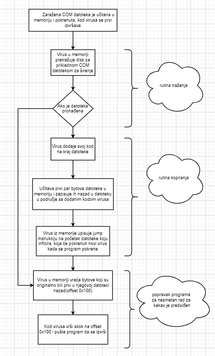
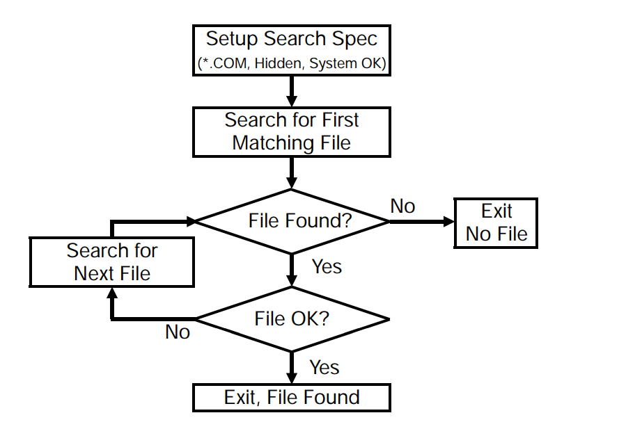

# UPOTREBA ASEMBLERA ZA IZRADU VIRUSA I OSNOVE DOS-a

# Sadržaj

[SEMINARSKI RAD 1](about:blank#seminarski-rad)

[UVOD 3](about:blank#uvod)

[VIRUSI 3](about:blank#virusi)

[FUNKCIONALNI ELEMENTI VIRUSA 4](about:blank#funkcionalni-elementi-virusa)

[DOS 5](about:blank#dos)

[COM FILE INFECTOR 7](about:blank#com-file-infector)

[POPIS LITERATURE 11](about:blank#popis-literature)

# UVOD

Ovaj seminarski rad bavi se obradom početaka virusa koji su pisani u asembleru, preciznije virusima 90ih godina. Sve navedene ideje virusa i ostale pretpostavke za računalne jezike, vrijedile su za tadašnja računala sa DOS operativnim sistemom i jezicima tog doba. Tadašnji najpogodniji pristup pisanju virusa je bio asembler. Jer jezici “više” razine kao Basic, C i Pascal su bili namijenjeni pisanju samostalni programa, te neke njihove pretpostavke su ih činile beskorisnima za pisanje virusa. Tako da virus pomoću tih jezika nije mogao izvoditi akrobacije kao što je skakanje s jednog programa na drugi. Također veličina virusa i njegova optimiziranost koda je igrala veliku ulogu jer su računala bila hardwerski ograničena, pa je asembler opet bio najbolji odabir za takve kratke programe. Osim svega navedenog asembler je i bio jedini način za korištenje svih računalni resursa na način koji korisnik želi, a ne kako je netko predvidio. Napomena, većina tehnički naziva nije prevođena radi lakšeg razumijevanja.

# VIRUSI

Računalni virus je program koji ima sposobnost preuzeti kontrolu nad računalom i stvoriti svoje funkcionalne kopije, tj. reproducirati se. Znanstveni naziv računalnog virusa glasio bi SRA, „self-reproducing automaton“. Pošto sama reprodukcija nije destruktivna, program ne mora imati destruktivnu narav da bi se klasificirao kao virus. Iako troši računalne resurse svojom reprodukcijom ali i pritom ne uništava domaćina, jer samo korištenje resursa ne mora biti i destruktivno. To ovisi i o tome koliko agresivno se reproducira, pa njegova reprodukcija može biti neprimjetna. Također se neki destruktivni programi ne mogu zvati virusima jer se ne reproduciraju iako prouzrokuju štetu, kao npr. logička bomba.

Tadašnji virusi su se mogli svrstati u nekoliko u kategorija.

Prva kategorija bi bili virusi koji mogu zaraziti bilo koji aplikacijski program. U DOS operativnom sustavu su bile ponuđene aplikacijske datoteke .com, .exe, .sys. Inače ako bi se prikvačio na bilo koji drugi oblik datoteke samo bi oštetio datoteku, ali se ne bi uspješno reproducirao, tj. ne bi napravio svoju potpuno funkcionalnu kopiju. Stoga se ova kategorija može podijeliti na potkategorije ovisno o tome jeli virus može zaraziti samo jedan tip, dva tipa ili sva tri tipa datoteke. Osim navedenih, u toj kategoriji su aplikacijski specifični virusi, tj. virusi koji traže specifičnu datoteku za širenje. Onaj tko izrađuje takav virus, također detaljno poznaje i ciljanu datoteku, pa može iskoristiti to prilikom izrade virusa. Što omogućava bolje skrivanje virusa unutar datoteke jer se može sakriti u području programa, a da pritom ne poremeti rad programa. Stoga se virus ne mora pokrenuti s programom, već u nekom trenutku prilikom rada programa.

U drugu kategoriju bi spadaju virusi koji inficiraju datoteke operativnog sustava. U slučaju DOS-a pritom koristi činjenicu da svako računalo s DOS operativnim sustavom ima COMMAND.COM datoteku. Stoga se postižu odlični uvjeti za širenje virusa, jer ciljana datoteka treba biti jako česta da bi se virus uspio proširiti, pa bi svako DOS računalo moglo biti ranjivo na ovakav oblik virusa.

U zadnju kategoriju bi spadali boot sector virusi. Koji su kao prerađene verzije aplication specific virusa, ali umjesto da traže specifičnu aplikaciju, oni traže specifični dio diska, boot sector. Boot sector je prva stvar što se učita u memoriju i izvrši nakon pokretanja računala. Pa bi virus mogao dobiti kontrolu nad računalom prije pokretanja bilo kojeg drugog programa, svaki put kada se računalo pokrene.

# FUNKCIONALNI ELEMENTI VIRUSA

Svaki virus bi trebao imati dvije osnovne rutine, traženje i kopiranje.

Traženje bi lociralo nove direktorije ili dijelove diska koji se daju zaraziti. Ono bi sadržavalo sve detalje o načinu širenja virusa i odlučivalo koliko brzo će se širiti, te kojom brzinom. Pritom bolja rutina traženja bi omogućila brže širenje ali bi onda povećala veličinu čitavog virusa.

Druga rutina, kopiranje, treba moći kopirati virus u područje dano rutinom traženje. Njena veličina i kompleksnost ovisi o tome jeli se kopira u .exe ili .com file.

Osim te dvije rutine virus može sadržavati dodatne značajke koje mogu spriječiti detekciju od strane lokalnog antivirusa ili korisnika, koja može biti dio dvije osnovne ili zasebna rutina. Kao na primjer što rutina traženja treba biti ograničena, inače ako pretražuje sve datoteke na svim diskovima bez ograničenja može biti lako primijećena od strane korisnika radi prevelike aktivnosti diska. Osim toga može biti implementirana na način da se virus pokreće samo nakon određenih uvjeta, kao određenog datuma ili ako nije bilo nikakve fizičke interakcije s računalom u zadnji 5 minuta što govori da korisnik nije tu.



Slika 1, Funkcijski dijagram virusa

Navedene tri rutine su jedine nužne komponente virusa. Osim tih triju dodavaju se dodatne rutine koje mogu biti destruktivne ili šaljive naravi. Dodavanje takvi rutina bi poremetilo osnovni cilj virusa da živi i reproducira se jer bi bio otkriven i uklonjen. Ali mnogi virusi služe samo za dostavu tih dodatnih rutina te autorima nije bitno što su uklonjeni sve dok je ta dodatna rutina izvršena, npr. ako logička bomba uništi i virus koji ju je isporučio.

# DOS

Najjednostavniji oblik računalnog virusa bi inficirao samo COM datoteke, iz razloga što su COM datoteke i same po sebi vrlo jednostavne. No prije same izrade virusa potrebno je razumjeti kako funkcionira ciljani mehanizam i njegove slabosti, točnije kako DOS učitava program u memoriju i pridjeljuje mu kontrolu. Za uspješno širenje virusa on treba biti dizajniran da se izvrši sa programom uz koji je prikvačen. Te nakon izvršavanja mora vratiti kontrolu samom programu nosiocu koji nastavlja rad bez smetnje.

Nakon unošenja naziva programa u DOS prompt on prvo pretražuje disk za datotekom tog naziva i s COM nastavkom, u slučaju da ne pronađe nijednu, traži EXE s nastavkom, pa zatim BAT. U slučaju da ne pronađe nijedno od te tri opcije vrati korisniku poruku greške. Od navedenih samo se COM i EXE direktno izvršavaju od strane procesora. COM datoteka predstavlja binarnu sliku onoga što se treba direktno učitati u memoriju i izvršiti procesorom, dok EXE ima složeniju strukturu. No prije samog izvršavanja DOS mora odraditi neke pripreme, jer DOS kontrolira i raspoređuje upotrebu memorije u računalu. Prvi zadatak za DOS bi bio provjera jeli ima dovoljno slobodne memorije za takav tip programa. Ako ima, rezervira memoriju za taj program, tako da bilježi koliko memorije je potrebno za takav tip programa. To je nužno jer u memoriji se nalazi više programa, a svaki je tu određeno vrijeme i njihove lokacije se ne smiju preklapati. Sljedeći korak DOS-a bi bio stvaranje bloka memorije od 256 B(0x100 lokacija x 1 B na svakoj lokaciji) poznatog kao Program Segment Prefix, PSP.



Format Program Segment Prefix bloka

Nakon stvaranja PSP DOS učitava COM datoteku sa diska u radnu memoriju, na memorijsku lokaciju iznad PSP, počevši od 0x100. Te kao završni korak prije negoli DOS preda kontrolu programu bi bio postavljanje registara na predefinirane vrijednosti, bez ispravno postavljenih segmentni registara program se neće moći pokrenuti.

Navedeni postupak bi se mogao pokušati prikazati kao izmijenjeni primjer iz stvarnog svijeta kao parkiralište gdje bi zaposlenik „DOS“ bio osoba koja se bavi parkiranjem auta. Stoga prvo mu dođe osoba sa zahtjevom da se pobrine za njegovo vozilo. Zatim „DOS“ otvara knjigu gdje je skica parkinga i traži najpogodnije slobodno mjesto. Ukoliko nije pronašao mjesto ispriča se gostu i upozori vlasnika parkinga da treba proširiti parking, ili ga ipak parkira van glavnog parkinga na zamjensko(„swap“) mjesto. A ako je ipak pronašao slobodno mjesto, obilježi ga u knjizi kao zauzeto. Zatim zaposlenik u rubriku knjige koja je ispod nacrtanog mjesta, zvanu „PSP“ unosi informacije osobe čije je vozilo preuzeo te tek nakon toga uzima ključeve automobila i vozi automobil na parking.

Za detaljniju razradu registara koristi se 8008 mikroprocesor. Njegovi registri su veličine 16 bita, 216 = 210*64, što znači ako spremamo adresu memorijske lokacije u registar, možemo adresirati maksimalno 64 kB memorije. Za korištenje više memorije trebamo više bita za adresiranje te memorije. Ali ipak ovaj model postiže adresiranje do 1 MB pomoću segmentacije. Umjesto da sprema jednu adresu u jedan registar, on je sprema u dva registra, te tako segmentira, razbija na dijelove adresu. Pomoću te metode može adresirati 20 bita dugačku adresu, 210 = 1 M. Takav par registara se sastoji od segment registra, koji sadrži najznačajnije bitove adrese(MSB) i offset registra koji sadrži najmanje važne bitove(LSB). Segmentni registar pokazuje na blok memorije od 16 byte, dok offset registar govori koliko bitova treba dodati na početak 16 byte bloka za lociranje željene memorija.

Npr. korištenje DS i BX registara(16 bit podatkovni registri) za dohvat memorijske adrese od 20 bita, ds:[bx]:

```coffeescript
DS = 0x1275

BX = 0x457

0x1275 x 0x10 = 0x12750

0x12750 + 0x457 = 0x12BA7 ;željena adresa
```

Klasična programerska praksa bi bila postaviti segment registre i što manje ih dirati, koristeći offset registre da se dohvati što veći opseg adresa(64 kB maksimalno). Slično pristupanju nizu u memoriji, u registru se nalazi lokacija baze kojoj dodajemo korak, offset. Navedeni 8088 sadrži 4 registra cs, ds, ss i es. Code Segment(cs) registar specificira 64 k područje gdje su pohranjene instrukcije programa, takoreći ono po čemu PC(program counter prolazi). Data Segment(ds) služi za specificiranje segmenta gdje se nalaze varijable programa. Stack Segment(ss) specificira gdje je stog programa. Extra Segment(es) je ponuđen programeru za slobodnu upotrebu. Dakle ako procesor želi pristupiti instrukcijama u memoriji mora na odgovarajući segment registar(cs) dodati odgovarajući pomak da dobije punu adresu. COM tip datoteke je ograničene segmentne strukture, dizajnirani da koriste samo jedan registar, tako za njih vrijedi cs=ds=es=ss. Stoga i čitavi program koristi samo 64 kB memorije.

Nakon segmentni registara može se nastaviti sa PSP koji se nalazi na offset 0, početak segmenta alociranog za COM datoteku. Dakle nakon što DOS odabere slobodan segment memorije, na njegov početak postavi PSP, a zatim ispod (offset 0x100) doda COM datoteku identičnu kakva je na disku.



Memorijska mapa prije izvršavanja COM datoteke

Program se izvršava tako da DOS daje kontrolu pogramu skokom na offset 0x100 u Code Segment gdje je učitan program. Od tu program se izvršava, radi sustavske pozive, pristupa I/O uređajima… Nakon što završi vraća kontrolu DOS-u koji oslobađa memoriju danu tom programu i daje korisniku drugi naredbeni redak.

# COM FILE INFECTOR

Nakon upoznavanja sa osnovama DOS-a može se započeti s razmatranjem mogućnosti izrade virusa. Kao što je navedeno virus mora biti izvršen, treba mu se pružiti kontrola, tj. procesor treba u nekoj točki rada programa izvršiti njegov kod. Virus bi mogao ispitati čitavu datoteku i odlučiti gdje bi se najbolje mogao ugraditi tako da uvijek može preuzeti kontrolu tokom rada programa, ali to bi zahtijevalo kompliciranu rutinu kopiranja. Stoga se pristupa rješenju preuzimanja kontrole na početku programa iz više razloga. Takvo rješenje je brzo i jednostavno što čini virus manjim i bržim. Drugi još važniji razlog bi bio što je virus u tom trenutku slobodan koristiti bilo koji prostor iznad COM File Image na slici iznad. Razlog toga je što program nije počeo s izvršavanjem i nije stigao postaviti varijable, niti pomicati stog, pa je memorija praktički netaknuta. Tako da virus vjerovatno neće poremetiti rad programa njegovim oštećivanjem, pa je ovo jako sigurno vrijeme za sam virus.

Oduzimanje kontrole na početku programa se ostvaruje zamjenom prvih par bytova koda sa skokom na dio koda sa virusom, koji se može dodati na kraj COM datoteke. Ali nakon izvršavanja virusa da bi vratili programu kontrolu moramo i prije toga obnoviti prvih par bytova koje smo zamijenili skokom, pa tek onda skočiti nazad na 0x100, i tako vratiti programu kontrolu.



Primjer širenja virusa

Na slici je predstavljena osnovna ideja širenja virusa, a koraci širenja su predstavljeni na sljedećoj slici:



Prvi korak virusa nakon njegova izvršenja bi bila rutina traženja nove datoteke. Pisanje takve rutine(i ostalih) zahtjeva dodatno znanje o radu računala što će se objasniti sljedeće.

Sve informacije o svakoj datoteci na disku su pohranjene na dva područja diska, poznata kao Directory i File Allocation Table(FAT). Directory sadržava 32 byte File Descriptor Record za svaku datoteku, koji sadržava ključne informacije o datoteci koje govore operativnom sistemu kako rukovati s tom datotekom. FAT predstavlja mapu čitavog diska koja informira operativni sistem koja su područja zauzeta kojim datotekama, te svaki disk sadržava dva FAT-a, drugi je kopija prvog i služi kao backup u slučaju kvara prvog. Poseban direktorij zvan root je prisutan na svakom disku, te ima fiksnu lokaciju na disku, kao i sami FAT, koja je rezervirana posebno za njih. Ostali direktoriji, koji su poddirektoriji root-a su smješteni na disku kao i same datoteke, uz razliku što im je u atributima naznačeno da se radi o direktoriju. Sav pristup datotekama se obavlja preko DOS-a što olakšava korisniku upotrebu, tako da bi rekli DOS-u što želimo koristimo Interrupt Service Routines(ISR). Primjer pristupanja datoteci pomoću ISR bi bio sljedeći,

```coffeescript
mov ds,SEG FNAME ;ds:dx pohranjuje memorijsku adresu datoteke za čitanje

mov dx,OFFSET FNAME

xor al,al ;al=0, želimo da se datoteka otvori samo za čitanje

mov ah,3DH ;DOS funkcija 3D, govori DOS-u što želimo da učini

int 21H ;izvrši
```

Navedeni kod govori DOS-u da pronađe datoteku čije ime je spremljeno na memorijskoj lokaciji FNAME i pripremi je za učitavanje u memoriju. Nakon „int 21H“ instrukcije kontrola se predaje DOS-u koji obavlja ostatak posla, te po završetku učitavanja datoteke izvršavanje se vraća na sljedeću liniju ispod „int 21H“. Prije samog poziva prekida definirani su memorijska lokacija datoteke, mod rada s datotekom te najbitnije što želimo od DOS-a da učini(3DH – učitavanje datoteke s diska u memoriju). Registri mogu biti različito popunjeni što ovisi o vrijednosti „ah“ registra, tj. što želimo od DOS-a. Ali virus ne zna kako se datoteka zove da bi mogao koristiti taj sustavski poziv, virus zna samo da završava sa .com. Stoga je potrebno koristiti funkcije traženja koje su predefinirane DOS-om, te ponuđene su Search First i Search Next. Prvi dio bi bio postavljanje ASCII Stringa u memoriju koji sadržava direktorij po kojem vršimo pretragu i što tražimo. To je običan niz bytova koji je terminiran null bytom(0). DOS može vratiti sve datoteke u direktoriju, ili samo neke koje ispunjavaju određene uvjete. Te uvjete postižemo pomoću * ili ?, tako da „\system\*.com“ uvjet ispunjavaju sve datoteke u direktoriju „system“ sa .com ekstenzijom. Nakon postavljanja ASCII stringa u memoriju trebamo postaviti ds i dx registre na tu lokaciju, a registar cl maskirati tako da DOS zna koje atribute datoteka da uključi, a koje da isključi iz pretrage(npr. ako je datoteka skrivena). Te konačno ah na vrijednost 0x4E koji je kod te funkcije. Ukoliko je pronađena takva datoteka, al će biti postavljen na 0, a rezultati pretrage su smješteni u Dana Transfer Area(DTA). Ukoliko ništa nije pronađeno al će biti različit od nule, a DTA prazan. Pošto program zna adresu od DTA može nakon pretrage ispitati to područje. Nakon što virus pronađe datoteku, ispitiva je jeli prikladna, ukoliko nije koristimo Search Next koji je sličan funkciji Search First, uz to još koristi rezultate prve pretrage.



Rutina „File OK“ treba ispitati jeli datoteka ima dovoljno prostora za virus, jer su COM datoteke ograničene na 64 kB, te jeli datoteka već zaražena. Provjera jeli datoteka ima dovoljno prostora se vrlo lako izvrši zbrajanjem 0x100(PSP), virusa, te koda datoteke. Ako dodajemo to sve u ax registar, te dođe do preljeva upaliti će se zastavica c(carry) koju možemo lako provjeriti. Drugi dio je kako će virus znati jeli već zarazi tu datoteku, to postiže pomoću poznavanja koda koji dodaje na početak zaražene datoteke. Moguće rješenje je da ako se na početku nalazi jump instrukcija, tu datoteku će smatrati zaraženom, iako ne mora biti zaražena već samo ima jump instrukciju na početku. Stoga se dodaje još fiksna vrijednost uz instrukciju koja će potrošiti dodatni par byte-ova početka programa. Stoga u rutini provjere datoteke mora još učitati prvih par byte-ova datoteke i ispitati ih. Iako smo naveli da datoteku otvaramo u modu čitanja, otvarati ćemo je u modu čitanje i pisanje, jer ćemo tako odmah eliminirati datoteke kojima je pristup ograničen(one s read only atributom), a kasnije ih ne bi mogli zaraziti.

Nakon što je datoteka provjerena slijedi rutina kopiranja koja koristi slične postupke s registrima kao i prethodno objašnjena rutina. Rutina kopiranja će kod virusa dodati na kraj datoteke, zatim će učitati početak datoteke i dodati ga na kraj sa virusom. Na to mjesto na početku datoteke će upisati skok na kraj originalne datoteke(početak koda virusa) i fiksnu vrijednosti za identifikaciju. Nakon toga je nova datoteka uspješno zaražena. Zadnji korak bi bio vraćanje originalnog koda datoteke u memoriji na memorijsku lokaciju 0x100 i predaja kontrole glavnom programu skokom izvršavanja na 0x100. Nakon izrade virusa potrebna je još jedino prva inficirana datoteka koja može biti nekoliko „nop“ naredbi u assembleru i čiji je jedini posao širenje virusa.

Ovaj princip omogućava maksimalno jedno širenje po jednom paljenju aplikacije i ograničeno je na jedan direktorij za pretragu datoteka te jedan tip datoteke, pa poprilično siguran model virusa za ispitivanje.

# POPIS LITERATURE

- The little black book of computer viruses by Mark Ludwig